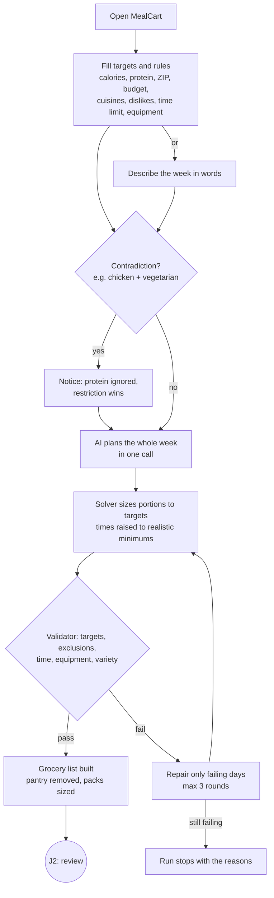
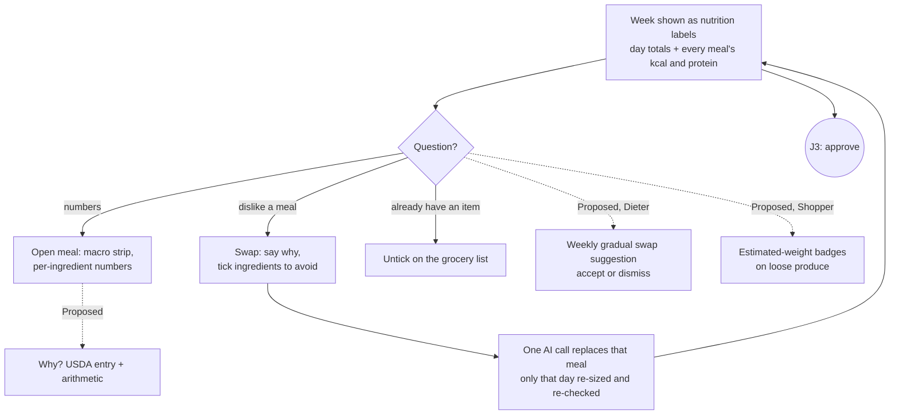
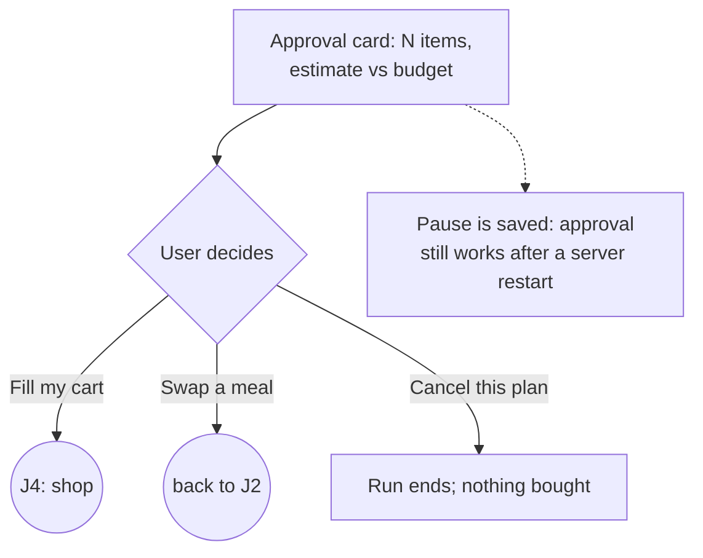
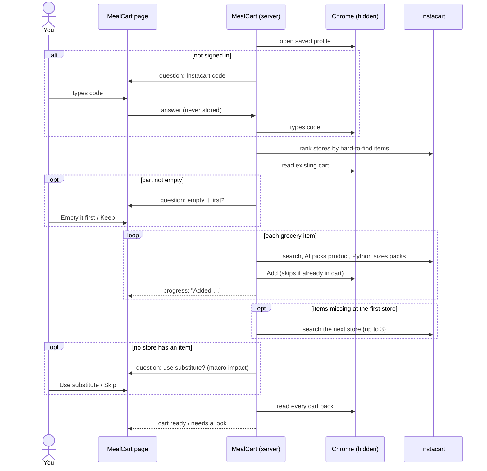
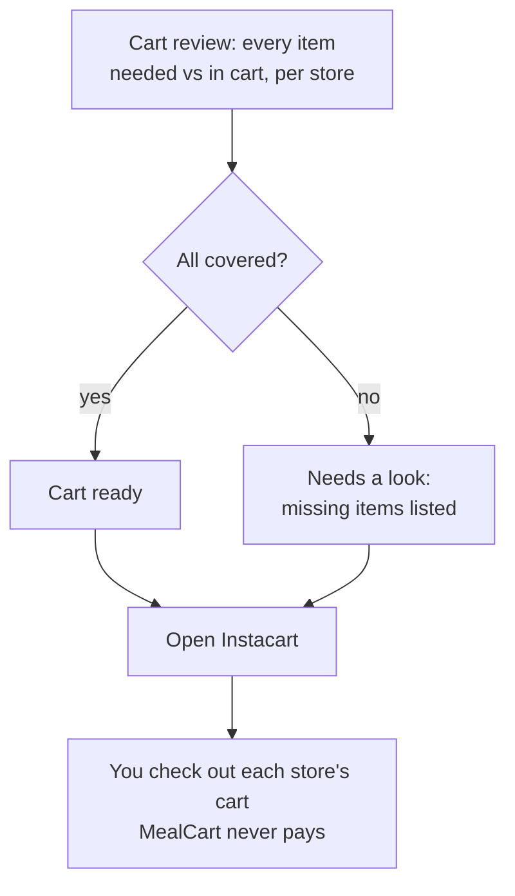

# MealCart: Design Specification

MealCart plans a week of meals to a calorie and protein target, checks every day against USDA
nutrition data, and fills the user's Instacart cart. It **stops at a filled, verified cart: the
person always checks out themselves.** This document specifies the experience of the working MVP
and the additions we propose, for three personas.

- **MVP source code:** [github.com/srinathvenkatesh25/mealcart.ai](https://github.com/srinathvenkatesh25/mealcart.ai/tree/1c3682d)
  (all code links below are pinned to commit `1c3682d`).
- **Interactive prototype:** [srinathvenkatesh25.github.io/mealcart-design/prototype/](https://srinathvenkatesh25.github.io/mealcart-design/prototype/)
  (files in [`prototype/`](prototype/)).

### How to read this document

Every feature is marked:

- **Built**: in the MVP today, with a link to the code.
- **Proposed**: designed here, demonstrated in the prototype, not yet in the MVP. Where the data a
  Proposed feature needs already exists in the MVP's backend, we say so.

Numbers in the examples come from a real MealCart run (`run_b91aa67527f8`: 7 days of Mexican
meals at 1,850 kcal and 80 g protein a day, a $80 budget, and a verified 14-item Kroger cart of
$54.50).

---

## 1. Personas and mental models

These are our team's three personas, with needs, tasks and success criteria exactly as defined.
For each we add the mental model the design must respect and where MealCart meets each task.

### 1.1 The Always-on-the-Go Planner

| | |
|---|---|
| **Needs** | Quick, low-effort meals made with accessible ingredients. |
| **Tasks** | Generate a quick, realistic weekly meal plan. Find fast-prep meals with accessible ingredients. Adjust meals conversationally as schedules change. |
| **Success** | Spends less time planning and preparing meals. Receives meals that fit their schedule. Follows the plan with less decision fatigue. |
| **Mental model** | *"An assistant that does the planning so I don't have to think."* Expects a sensible default on the first try, and a one-sentence way to change things. Won't read long explanations. |

| Task | Built | Proposed |
|---|---|---|
| Quick, realistic weekly plan | A full week in one AI call, then portions sized by a solver ([`planner.py`](https://github.com/srinathvenkatesh25/mealcart.ai/blob/1c3682d/backend/app/planner/planner.py), [`solver.py`](https://github.com/srinathvenkatesh25/mealcart.ai/blob/1c3682d/backend/app/nutrition/solver.py)) | — |
| Fast-prep meals | Max-minutes-per-meal limit; realistic cooking-time floors (raw rice and chicken ≥ 15 min, dried beans ≥ 50) raise optimistic AI times ([`timing.py`](https://github.com/srinathvenkatesh25/mealcart.ai/blob/1c3682d/backend/app/nutrition/timing.py)) | Show *why* a time was raised in the meal itself (today only the activity feed says so) |
| Adjust conversationally | "Describe in words" input; **Swap a meal** with a plain-language reason ([`nodes.py`](https://github.com/srinathvenkatesh25/mealcart.ai/blob/1c3682d/backend/app/graph/nodes.py) `swap`) | — |

### 1.2 The Budget-Savvy Shopper

| | |
|---|---|
| **Needs** | Affordable, nutritious options with less waste. |
| **Tasks** | Set a weekly grocery budget. Optimize ingredients across multiple meals. Review and approve an affordable, low-waste cart. |
| **Success** | Keeps the grocery cart within budget. Avoids unnecessary purchases. Uses more of what is purchased and wastes less food. |
| **Mental model** | *"A cart builder I audit before money is spent."* Wants to see the total against the budget **before** shopping, and every line after. Distrusts anything that adds items silently. |

| Task | Built | Proposed |
|---|---|---|
| Set a weekly budget | Budget field; estimate vs budget on the approval card (from earlier cart prices); subtotal vs budget on the cart review ([`QuestionCard.tsx`](https://github.com/srinathvenkatesh25/mealcart.ai/blob/1c3682d/frontend/components/QuestionCard.tsx), [`CartReview.tsx`](https://github.com/srinathvenkatesh25/mealcart.ai/blob/1c3682d/frontend/components/CartReview.tsx)) | — |
| Optimize ingredients across meals | Planner told to reuse ingredients; the week is consolidated into one list (103 ingredient lines → 25 items in testing) ([`consolidator.py`](https://github.com/srinathvenkatesh25/mealcart.ai/blob/1c3682d/backend/app/shopping/consolidator.py)) | — |
| Approve an affordable, **low-waste** cart | Pantry list never bought; untick items you have; cart verified line by line ([`verify.py`](https://github.com/srinathvenkatesh25/mealcart.ai/blob/1c3682d/backend/app/shopping/verify.py)) | **Leftover cue**: show how much of each pack the week won't use. The data already exists: in the sample run the plan needs **40 g of peanut butter but the cart buys 454 g**, and 25 g of spinach becomes a 170 g bag. |

### 1.3 The On-and-Off Dieter

| | |
|---|---|
| **Needs** | Gradual, realistic changes built around familiar foods. |
| **Tasks** | Build healthier meals around familiar foods. Improve portions and nutritional balance. Introduce healthier alternatives gradually. |
| **Success** | Makes manageable changes without restrictive dieting. Follows the plan more consistently. |
| **Mental model** | *"A coach that nudges, not a strict diet."* Gives up when a plan feels foreign or punishing; needs to see that the numbers are honest, not to be lectured by them. |

| Task | Built | Proposed |
|---|---|---|
| Healthier meals, familiar foods | Cuisines, main protein, dislikes; restrictions spelled out to the AI and checked in code ([`validator.py`](https://github.com/srinathvenkatesh25/mealcart.ai/blob/1c3682d/backend/app/nutrition/validator.py)) | — |
| Portions and balance | Calories ±5% and protein ±10 g per day, sized by a solver; per-meal and per-ingredient calories and macros shown | "Why this number?": the USDA entry behind each ingredient |
| Healthier alternatives, **gradually** | Swap a meal (user-initiated) | **Gradual-change mode**: one small suggested swap per week, e.g. white rice → brown rice in one lunch (+1.6 kcal, −5.2 g carbs, computed with the MVP's own validator). MealCart doesn't track fiber yet, so the main benefit of whole grains isn't visible in its numbers; the suggestion says so. |

### 1.4 Decision rights: who final-signs

| Decision | Final say | Where | Status |
|---|---|---|---|
| Approve the plan and grocery list before any shopping | **User** | Approval card | Built |
| Swap a meal; untick an item; cancel the plan | **User** | Day cards, grocery list, approval card | Built |
| A substitute that breaks the plan's checks | **User** | Substitution question | Built |
| Empty a cart that already has items | **User** | Clear-cart question | Built |
| Sign-in codes, passwords, CAPTCHAs | **User** (answers pass straight through; never stored) | Question cards | Built |
| **Checkout and payment** | **User only, outside MealCart** (no checkout code path; the browser blocks checkout pages) | Instacart app | Built |
| Portion sizes, validation, up to 3 automatic repairs | System, within the user's targets and rules | — | Built |
| Store ranking, product picks, pack counts, up to 3 stores | System, within the approved list; substitutes that break the plan escalate to the user | — | Built |
| Weekly healthier-swap suggestion | System **suggests**, user accepts or dismisses | Plan view | Proposed |

The rule behind the table: **the system may decide anything that is reversible and checked; the
user signs anything that spends money, changes what they'll eat beyond their rules, or touches
their account.**

### 1.5 Interrogation moments

Points where a persona asks "why?", and what answers it.

| Moment | Persona | Answered by | Status |
|---|---|---|---|
| "Do these meals really add up to my target?" | Dieter | Per-meal calories and protein on every meal; per-ingredient numbers when opened; a rounding note | Built |
| "Where does this number come from?" | Dieter | **Why?** on an ingredient: the USDA entry, its per-100 g values, and the arithmetic (e.g. 100 g × 120 kcal/100 g = 120 kcal) | Proposed (USDA id and description already cached) |
| "Why did this meal's time change?" | Planner | Cooking-time note on the meal | Proposed UI (Built logic) |
| "Was this plan fixed by the system?" | Dieter, Shopper | Repair history: what the checks found and what changed | Proposed (validator notes exist) |
| "Why this product, this store?" | Shopper | **Why this product?**: the picker's stated reason; store-ranking evidence (which hard-to-find items each store stocks) | Proposed (the picker already returns a `reason`; ranking is in the feed) |
| "Is the cart really what I approved?" | Shopper | Cart review: needed vs in cart for every item, per store | Built |
| "Which AI answered, and how much did it use?" | All | Model-switch lines in the feed; AI usage line | Built |

### 1.6 Trust-calibration cues

| Cue | Kind | Status |
|---|---|---|
| Per-meal values shown rounded, with a note that totals can differ by a point or two | Uncertainty | Built |
| "Still off: Monday, Sunday" when portions can't reach the targets; those days go to repair | Uncertainty | Built |
| Price estimate labelled as an estimate from earlier carts | Uncertainty | Built (badge Proposed) |
| "Estimated weight" on loose produce sold by count (onion ≈ 150 g) | Uncertainty | Proposed (estimates exist in `packs.py`) |
| A human check stops the run with an explanation rather than reporting items as unavailable | Uncertainty | Built |
| ZIP mismatch warning: Instacart is delivering somewhere else | Provenance | Built |
| Every number traces to USDA FoodData Central | Provenance | Built (link per ingredient Proposed) |
| Cart read back from Instacart and compared with the list | Provenance | Built ("verified" stamp Proposed) |
| Which AI model answered, switches, and calls used | Provenance | Built |

---

## 2. User journeys and task flows

Five critical journeys, J1–J5, plus failure flows. The prototype has a journey picker for each.

### J1. Set targets → plan



### J2. Review and interrogate → swap or untick



### J3. Approve (the decision gate)



### J4. Shop, with pauses



### J5. Verify → hand off to checkout



### Failure flows (all Built)

| Situation | What the person sees | What happens |
|---|---|---|
| An AI model is out of free quota or busy | "AI model: … quota used up. Switching to …" in the feed | Next model in the list; short rate limits are waited out |
| Every model unavailable | "This plan stopped: every AI model is out of free quota or busy" | Run ends; nothing bought |
| Instacart delivers to a different ZIP | Warning before any item is added | Continues; note on the cart review |
| CAPTCHA mid-run in hidden mode | "Instacart asked for a human check" with how to fix | Run stops rather than misreporting items |
| Some items not found anywhere | "Your cart needs a look" with the missing items | Partial cart kept; user adds the rest |
| Page reloads or connection drops | "Reconnecting…" then the feed catches up | Events replayed from the last one seen |

---

## 3. Wireframes and interactions

Low-fidelity layouts; the prototype shows them at full fidelity.

### 3.1 Screens

**Set targets**
```
┌ MealCart ─────────── 1 Targets · 2 Plan · 3 Approve · 4 Cart ────────────┐
│ A week of meals that hits your numbers.                                   │
│ [ Set targets | Describe in words ]                                       │
│ ┌ Daily targets ───────────────┐                                          │
│ │ Calories  1850  │ Protein 80 │   ← nutrition-label style input          │
│ └──────────────────────────────┘                                          │
│ The week:   Days [7]  ZIP [_____]*  Budget [$80]  Cuisines [Mexican]       │
│ Never use:  Dislikes [...]  Allergies [...]  (vegetarian)(halal ✓)...      │
│ Kitchen:    Max min [30]  Effort [▾]  Skill [▾]  (stove ✓)(oven ✓)...      │
│ Pantry:     [salt, rice, oil]                                             │
│ [ Plan my week ]                                                          │
└───────────────────────────────────────────────────────────────────────────┘
```

**Review the week, with approval pending**
```
┌ 1,850 kcal · 80 g protein a day, for 7 days, Mexican ────┬ Your answer is needed ─┐
│ ┌ Monday ────────┐ ┌ Tuesday ───────┐ ┌ Wednesday ─────┐ │ Approve the list      │
│ │ Calories  1,850│ │ ...            │ │ ...            │ │ 14 items · ≈ $54.50   │
│ │ Protein    80 g│ │                │ │                │ │ within $80 budget     │
│ │ Carbs·Fat (grey)│                │ │                │ │ [Fill my cart][Cancel]│
│ │ Breakfast  383 kcal · 18 g  15m │ │                │ ├ Activity (newest) ────┤
│ │ Lunch      841 kcal · 32 g  25m │ │                │ │ List  14 items        │
│ │ Dinner     626 kcal · 30 g  20m │ │                │ │ Checks passed         │
│ │            [Swap]  ▸ open       │ │                │ │ AI model …            │
│ └─────────────────┘ └────────────┘ └────────────────┘ └───────────────────────┘
│ Grocery list (untick what you have)                                         │
│ ☑ chicken breast ≈ 2.25 lb   ☑ onion 8 × onion (≈ 2.4 lb) [est. weight]ᴾ      │
└────────────────────────────────────────────────────────────────────────────┘
ᴾ Proposed
```

**Meal opened**
```
│ Dinner  Quick Chicken and Potato Skillet          20 min │
│ ┌ CALORIES  PROTEIN   CARBS   FAT ┐                       │
│ │ 626       30 g      (grey)  (grey)│                      │
│ └─────────────────────────────────┘                       │
│ 100 g chicken breast        120 kcal · 23 g   [Why?]ᴾ     │
│ 330 g potato                254 kcal ·  7 g   [Why?]ᴾ     │
│ 1. … steps …                                              │
│ Uses stove, microwave                         [Swap]      │
```

**Question card** (one shape for every pause)
```
┌ YOUR ANSWER IS NEEDED ───────────────┐
│ Enter your Instacart code            │
│ Instacart sent a code. What is it?   │
│ [ ______ ] [Send code]               │
│ Typed straight into Instacart.       │
│ MealCart doesn't save it.            │
└──────────────────────────────────────┘
```

**Cart review**
```
┌ Your cart is ready · At Kroger · $54.50 · within your $80 budget ─────────┐
│ FOR            IN YOUR CART                   NEED / HAVE  LEFT OVERᴾ PRICE │
│ ✓ banana       Fresh Bunch of Bananas × 1      340 / 1361 g  1021 g    $1.77 │
│ ✓ peanut butter Creamy Peanut Butter × 1        40 /  454 g   414 g    $2.49 │
│                [Why this product?]ᴾ                                        │
│ …                                                                          │
│ Subtotal before fees                                              $54.50   │
│ AI used: 4 calls · free tier · gemini-3.6-flash ×2, gpt-oss-120b ×2       │
│ [ Open Instacart ]  You check out yourself; MealCart never pays.          │
└────────────────────────────────────────────────────────────────────────────┘
```

### 3.2 Input controls

| Control | Behaviour | Status |
|---|---|---|
| Calories and protein | Large numeric fields styled as the top of a nutrition label; the only gated targets | Built |
| ZIP code | Empty, required, 5 digits only (letters stripped as typed); server rejects anything else | Built |
| Budget, days, max minutes | Numeric with units; budget optional | Built |
| Dislikes, allergies, cuisines, pantry | Comma-separated text, split into lists on submit | Built |
| Restrictions, equipment | Filter chips | Built |
| Effort, skill | Selects | Built |
| Describe in words | Free text, parsed into the same preferences (one AI call); must include the ZIP | Built |
| Swap | Reason (optional) + "never use again" chips built from that meal's ingredients | Built |
| Login code | One-time-code field, numeric keypad on phones | Built |

### 3.3 Streaming outputs

- **Live feed:** the server pushes progress over a WebSocket; lines appear newest-first, so new
  text never scrolls the page. Labels name the step: Planning, Portions, Checks, List, Swap,
  Instacart, AI model.
- **Placeholder labels** pulse while the week is being planned (about a minute).
- **Reconnect:** each event has a sequence number; after a drop the page asks only for what it
  missed. A paused question is re-asked after a server restart.
- **Notifications:** if the tab is hidden when a question arrives, the browser shows a
  notification and plays a short tone.

### 3.4 Feedback loops

| Loop | Steps |
|---|---|
| Swap | Swap → one AI call → only that day re-sized → re-checked → list rebuilt → asked to approve again |
| Untick | Untick → approval card shows fewer items and a lower estimate → approve sends the edited list |
| Answer | Answer → "resolved" → feed continues; an answer to a question that has already closed is refused with a notice |
| Repair | A failing check → specific notes back to the AI for those days only → re-check (max 3) |
| Price memory | Prices seen in each cart are remembered → the next approval card shows an estimate |

### 3.5 States

| State | Treatment |
|---|---|
| Empty | The form with "How a run goes" in the side rail |
| Loading | Pulsing placeholder labels; "Working…" in the feed |
| Waiting on you | Turmeric-bordered question card; step 3 highlighted |
| Error | Chili-bordered "This plan stopped" card naming the cause, plus "Start a new plan" |
| Partial success | "Your cart needs a look" with missing items listed |

---

## 4. Design system alignment: Material 3

MealCart follows Material 3's structure (colour roles, type scale, shape, components and state
layers) with its own brand colours and typefaces, which Material 3 explicitly allows.

### 4.1 Colour roles

| M3 role | MealCart token | Light | Dark | Used for |
|---|---|---|---|---|
| primary | `--leaf` (curry leaf) | `#2F5D46` | `#78B996` | Main actions: Plan my week, Fill my cart |
| on-primary | `--leaf-ink` | `#FFFFFF` | `#0D1A13` | Text on primary |
| primary-container | `--leaf-wash` | `#E3EDE7` | `#1C2B23` | Selected chips, checkout box |
| tertiary | `--turmeric` | `#E2A400` | `#F0B92B` | Waiting on you: question card, current step, focus ring |
| tertiary-container | `--turmeric-wash` | `#FBF0CF` | `#2E2610` | Question card glow, swap form |
| error | `--chili` | `#B23A28` | `#E3705C` | Over budget, missing items, run stopped |
| error-container | `--chili-wash` | `#F8E4DF` | `#33201C` | Error callouts |
| surface | `--paper` | `#F5F7F4` | `#111416` | Page |
| surface-container-lowest | `--card` | `#FFFFFF` | `#181C1F` | Cards, inputs |
| on-surface | `--ink` | `#15191C` | `#ECEEEA` | Text, label rules |
| on-surface-variant | `--steel` | `#5F6A71` | `#9AA4AA` | Secondary text, carbs and fat |
| outline-variant | `--hair` | `#D3D9D5` | `#2C3337` | Dividers, field borders |

Turmeric is used for **attention** (waiting on you) rather than as a second brand colour. That
keeps "the system needs you" visually distinct from "you can act" (primary) and "something is
wrong" (error).

### 4.2 Type scale

| M3 role | MealCart use | Face |
|---|---|---|
| Display | Hero headline | Libre Franklin 900 |
| Headline | Section titles; day names on labels | Libre Franklin 900 |
| Title | Card titles, meal titles | Libre Franklin 600–900 |
| Body | Copy | Libre Franklin 400 |
| Label | Eyebrows, slot names, buttons | Libre Franklin 700–800 |
| (data) | Grams, prices, token counts | IBM Plex Mono 400–500 |

Libre Franklin is a revival of Franklin Gothic, the typeface of US Nutrition Facts labels. Using
it lets the nutrition-label cards read as labels, not as cards imitating them.

### 4.3 Components

| MealCart element | M3 component | Notes |
|---|---|---|
| Plan my week, Fill my cart | Filled button | |
| Cancel, Keep those items, New plan | Outlined button | |
| Swap, Why? | Text button | Swap appears on hover or focus on desktop; always visible on touch |
| Set targets / Describe in words | Segmented button | Two mutually exclusive modes |
| Restrictions, equipment | Filter chips | |
| Form fields | Outlined text fields | Targets use a deliberate label variant (4.6) |
| Question card | Outlined card with tertiary emphasis | A modal dialog was rejected: it would hide the plan the person is deciding about |
| Why? explanations (Proposed) | Rich tooltip content | Opens on click and expands inline under the number, so it works on touch and on narrow day cards |
| Activity feed | List with dividers | |
| Planning placeholder, Working… | Progress indicators (indeterminate) | |
| Leftover, estimate, verified badges (Proposed) | Badges / assist chips | |
| Cart review | (no M3 data table) | M3 has no data-table component; we use a semantic HTML table with M3 tokens, dividers and type roles |
| Steps 1–4 in the header | (no M3 stepper) | A custom step indicator; the current step uses tertiary, completed steps primary |

### 4.4 Shape, elevation and state

- **Shape:** buttons, fields, chips and the question card use M3 *extra-small/small* (6 px).
  Nutrition-label cards use near-square corners (2 px) on purpose (4.6).
- **Elevation:** flat surfaces with outlines rather than shadows, in line with M3's
  tonal-surface approach; the question card's tertiary glow is the only lift.
- **State layers:** hover and pressed states darken primary by mixing in on-surface; disabled at
  50% opacity.
- **Focus:** a 3 px turmeric outline with a 2 px offset on every interactive element.

### 4.5 Accessibility

- Text colours meet WCAG AA contrast on their surfaces in both themes.
- Live regions: the feed is `aria-live="polite"`; the question card is `aria-live="assertive"`.
- `prefers-reduced-motion` disables all animation.
- Every control is reachable by keyboard; Swap becomes visible on keyboard focus.
- **Gap to fix:** M3 recommends 48 × 48 dp touch targets; MealCart's buttons are 40 px tall and
  the Swap and Why? text buttons are smaller. Proposed: raise touch targets to 48 px on
  coarse pointers.

### 4.6 Deliberate deviations

| Deviation | Why |
|---|---|
| **Nutrition-label day cards** (heavy black rules, Franklin 900, near-square corners) | The product's promise is macro accuracy checked against USDA data. A Nutrition Facts label is the most recognisable object for "these numbers are real", so each day is shown as one. This is the one signature element; everything around it stays quiet. |
| Monospace numbers | Grams and prices line up in columns and read as measured data |
| No data table or stepper components | M3 doesn't define them (4.3) |

---

## 5. Traceability: no orphan features

Every UI element serves at least one persona task. The second table checks the reverse.

### 5.1 UI element → persona task → MVP source

| # | UI element | Persona task(s) served | MVP source | Status |
|---|---|---|---|---|
| 1 | Calories and protein targets | Dieter: portions and balance · Planner: realistic plan | [`SpecForm.tsx`](https://github.com/srinathvenkatesh25/mealcart.ai/blob/1c3682d/frontend/components/SpecForm.tsx), [`solver.py`](https://github.com/srinathvenkatesh25/mealcart.ai/blob/1c3682d/backend/app/nutrition/solver.py) | Built |
| 2 | Describe in words | Planner: adjust conversationally | `SpecForm.tsx`, [`intake.py`](https://github.com/srinathvenkatesh25/mealcart.ai/blob/1c3682d/backend/app/intake/intake.py) | Built |
| 3 | Max minutes, effort, skill, equipment | Planner: fast-prep meals | `SpecForm.tsx`, `validator.py` | Built |
| 4 | Cuisines, main protein | Dieter: familiar foods | `SpecForm.tsx`, [`prompts.py`](https://github.com/srinathvenkatesh25/mealcart.ai/blob/1c3682d/backend/app/planner/prompts.py) | Built |
| 5 | Dislikes, allergies, restriction chips | Dieter: familiar foods · Planner: accessible ingredients | `SpecForm.tsx`, [`maps.py`](https://github.com/srinathvenkatesh25/mealcart.ai/blob/1c3682d/backend/app/nutrition/maps.py) | Built |
| 6 | Pantry field | Shopper: avoid unnecessary purchases | `SpecForm.tsx`, `consolidator.py` | Built |
| 7 | Weekly budget | Shopper: set a weekly budget | `SpecForm.tsx` | Built |
| 8 | ZIP field and mismatch warning | Shopper: approve an affordable cart (right store and prices) | [`models.py`](https://github.com/srinathvenkatesh25/mealcart.ai/blob/1c3682d/backend/app/models.py), [`shopper.py`](https://github.com/srinathvenkatesh25/mealcart.ai/blob/1c3682d/backend/app/shopping/shopper.py) | Built |
| 9 | Live activity feed | Planner: less time planning (see progress, not wait blind) | [`ActivityFeed.tsx`](https://github.com/srinathvenkatesh25/mealcart.ai/blob/1c3682d/frontend/components/ActivityFeed.tsx), [`useRun.ts`](https://github.com/srinathvenkatesh25/mealcart.ai/blob/1c3682d/frontend/lib/useRun.ts) | Built |
| 10 | Nutrition-label day cards | Dieter: portions and balance | [`PlanView.tsx`](https://github.com/srinathvenkatesh25/mealcart.ai/blob/1c3682d/frontend/components/PlanView.tsx) | Built |
| 11 | Per-meal and per-ingredient numbers | Dieter: portions and balance | `PlanView.tsx`, `validator.py` | Built |
| 12 | Cooking-time note on the meal | Planner: meals that fit their schedule | `timing.py` | Built logic; note in meal Proposed |
| 13 | Swap a meal (reason + avoid) | Planner: adjust conversationally · Dieter: alternatives | `PlanView.tsx`, `nodes.py` | Built |
| 14 | Grocery list with untick | Shopper: optimize ingredients · avoid unnecessary purchases | [`GroceryList.tsx`](https://github.com/srinathvenkatesh25/mealcart.ai/blob/1c3682d/frontend/components/GroceryList.tsx) | Built |
| 15 | Approval card with estimate vs budget | Shopper: review and approve within budget | `QuestionCard.tsx` | Built |
| 16 | Questions: code, CAPTCHA, substitute, clear cart | Shopper: approve the cart · all: decision rights | `QuestionCard.tsx`, [`registry.py`](https://github.com/srinathvenkatesh25/mealcart.ai/blob/1c3682d/backend/app/graph/registry.py) | Built |
| 17 | Cart review, per store, needed vs in cart | Shopper: review and approve the cart · keep within budget | `CartReview.tsx`, `verify.py` | Built |
| 18 | AI usage line and model-switch lines | All: trust what happened | [`UsageLine.tsx`](https://github.com/srinathvenkatesh25/mealcart.ai/blob/1c3682d/frontend/components/UsageLine.tsx), [`llm.py`](https://github.com/srinathvenkatesh25/mealcart.ai/blob/1c3682d/backend/app/planner/llm.py) | Built |
| 19 | Why? USDA provenance | Dieter: trust the balance shown | [`usda.py`](https://github.com/srinathvenkatesh25/mealcart.ai/blob/1c3682d/backend/app/nutrition/usda.py) (id and description cached) | Proposed |
| 20 | Why this product? | Shopper: approve the cart | `shopper.py` (`Pick.reason` returned, not shown) | Proposed |
| 21 | Leftover cue | Shopper: low-waste cart · uses more of what is bought | `verify.py` (coverage data) | Proposed |
| 22 | Weekly gradual swap suggestion | Dieter: introduce alternatives gradually | `validator.py` (impact computed) | Proposed |
| 23 | Repair history | Dieter, Shopper: trust the plan | `validator.py` notes | Proposed |
| 24 | Estimate and estimated-weight badges | Shopper: keep within budget (know what's uncertain) | [`packs.py`](https://github.com/srinathvenkatesh25/mealcart.ai/blob/1c3682d/backend/app/shopping/packs.py) | Proposed |
| 25 | Open Instacart hand-off | All: decision rights (you pay) | `CartReview.tsx`, [`guard.py`](https://github.com/srinathvenkatesh25/mealcart.ai/blob/1c3682d/backend/app/shopping/guard.py) | Built |

### 5.2 Persona task → UI elements (the reverse check)

| Persona task | UI elements |
|---|---|
| Planner: generate a quick, realistic weekly plan | 1, 9, 12 |
| Planner: find fast-prep meals with accessible ingredients | 3, 5, 12 |
| Planner: adjust meals conversationally | 2, 13 |
| Shopper: set a weekly grocery budget | 7, 15, 24 |
| Shopper: optimize ingredients across multiple meals | 14 |
| Shopper: review and approve an affordable, low-waste cart | 8, 15, 16, 17, 20, 21 |
| Dieter: build healthier meals around familiar foods | 4, 5, 10 |
| Dieter: improve portions and nutritional balance | 1, 10, 11, 19 |
| Dieter: introduce healthier alternatives gradually | 13, 22 |

Every task has at least one element, and every element serves a task.

---

## 6. Open questions and risks

| Risk or question | Notes |
|---|---|
| Instacart's terms discourage automated access | Personal, human-paced use; one account; no checkout; a hidden browser can be flagged as a bot, so `visible` mode is available |
| Free AI quotas | About 20 requests per Gemini model per day; runs fall back to Groq, which is slower |
| Single user, local only | No sign-in; not reachable from other devices by design |
| Fiber and micronutrients aren't tracked | Limits how "healthier" can be shown for the Dieter (gradual swaps state this) |
| Leftover cue could push buying smaller, pricier packs | The cue should show cost per used gram, not just waste |
| Touch-target size | Below M3's 48 dp recommendation (4.5) |
| Proposed features need user testing | Especially whether Why? explanations reduce or add decision fatigue for the Planner |
